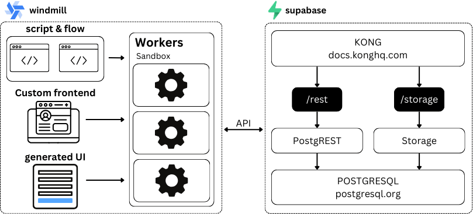
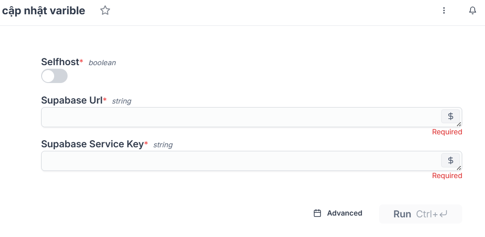

[](https://github.com/CTUbase/OpenHeart/blob/master/LICENSE)
[](https://github.com/CTUbase/OpenHeart/issues)
[](https://github.com/CTUbase/OpenHeart/pulls)
[](https://github.com/CTUbase/OpenHeart/graphs/commit-activity)
[](https://github.com/CTUbase/OpenHeart/graphs/contributors)

# OpenHeart

<a href="https://github.com/CTUbase/OpenHeart/issues/new?assignees=&labels=&projects=&template=bug_report.md&title=%F0%9F%90%9B+Bug+Report%3A+">Bug Report ⚠️
</a>
<a href="https://github.com/CTUbase/OpenHeart/issues/new?assignees=&labels=&projects=&template=feature_request.md&title=RequestFeature:">Request Feature 👩‍💻</a>

Ứng dụng hỗ trợ tổ chức phi lợi nhuận trong việc quản lý tình nguyện viên và tổ chức sự kiện một cách dễ dàng. Đây là nền tảng kết nối những người muốn tham gia tình nguyện với các cơ hội phù hợp, nhằm tạo ra tác động tích cực trong cộng đồng.

Mục tiêu của hệ thống là:
1. **Tăng cường hoạt động tình nguyện**: Giúp mọi người, đặc biệt là thế hệ trẻ (Gen Z), dễ dàng tìm kiếm và tham gia các hoạt động tình nguyện phù hợp với sở thích và thời gian của họ.

2. **Hỗ trợ tổ chức phi lợi nhuận**: Cung cấp các công cụ giúp các tổ chức dễ dàng quản lý sự kiện, theo dõi tình nguyện viên, và báo cáo tác động của các hoạt động.

3. **Xây dựng cộng đồng tích cực**: Tạo điều kiện để mọi người gắn kết, tham gia các hoạt động có ý nghĩa và đóng góp cho xã hội một cách bền vững.

4. **Đơn giản hóa quy trình quản lý tình nguyện**: Loại bỏ các rào cản kỹ thuật bằng cách số hóa quy trình, từ đăng ký, tổ chức đến theo dõi và ghi nhận đóng góp của tình nguyện viên.

Dự án được thực hiện trong cuộc thi [Phần Mềm Nguồn Mở-Olympic Tin học Sinh viên Việt Nam 2024]([https://www.olp.vn/procon-pmmn/ph%E1%BA%A7n-m%E1%BB%81m-ngu%E1%BB%93n-m%E1%BB%9F](https://www.olp.vn/procon-pmmn/ph%E1%BA%A7n-m%E1%BB%81m-ngu%E1%BB%93n-m%E1%BB%9F)). Được open source theo giấy phép [Apache v2.0](https://opensource.org/license/apache-2-0) bởi đội tác giả CTUBase.


## Chức Năng Chính

Project tập trung vào các chức năng chính như sau:

-   Tạo và quản lý các sự kiện tình nguyện đối với tổ chức.
-   Theo dỗi và đăng ký các sự kiện tình nguyện đối với tình nguyện viên.

## 👩‍💻 Tổng Quan Hệ Thống

Hệ thống sử dụng [Windmill](https://www.windmill.dev/) cho front-end và workflow cùng với [Supabase](https://supabase.com/) cho backend:


## Hướng Dẫn Cài Đặt

### Yêu Cầu 📋

Để cài đặt và chạy được dự án, trước tiên bạn cần phải cài đặt các công cụ bên dưới. Hãy thực hiện theo các hướng dẫn cài đặt sau, lưu ý chọn hệ điều hành phù hợp với máy tính của bạn:
-   [Node JS](https://nodejs.org/en/download/prebuilt-installer): sử dụng npm giúp cài đặt windmill CLI và supabase CLI.
-   [Windmill CLI](https://docs.docker.com/get-docker/): cài đặt frontend của hệ thống
-   [Supabase CLI](https://supabase.com/docs/guides/local-development/cli/getting-started?queryGroups=platform&platform=npx&queryGroups=access-method&access-method=studio): cài đặt backend của hệ thống.
-   [Docker Desktop](https://docs.docker.com/desktop/setup/install/windows-install/): (tùy chọn) dành cho cài đặt self-host.

### 🔨 Cài Đặt

Trước hết, hãy clone dự án về máy tính của bạn:

```bash
git clone https://github.com/CTUbase/OpenHeart.git 
```
sau đó hãy cd đến OpenHeart:
```bash
cd OpenHeart
```
### Chạy backend với Supabase

**Đối với self-host:** cd đến thư mục /supabase và chạy CLI:
```bash
cd supabase
npx supabase start 
```
Sau khi hoành thành, supabase sẽ chạy ở địa chỉ <a href="http://localhost:8000/">localhost:8000</a>.

**Đối với supabase cloud:** 
-   **Bước 1:** cd đến thư mục /supbase và login vào tài khoản supabase của bạn bằng [personal access token](https://supabase.com/dashboard/account/tokens):
```
cd supabase
npx supabase login
```
-   **Bước 2:** Tạo một project mới trên Supabase, sau đó kết với project thông qua project ID:
```bash
npx supbase link --project-ref [PROJECT_ID]
```
Bạn có thể tìm thấy project ID trên thanh URL tại Dashboard:
```bash
https://supabase.com/dashboard/project/<project-id>
```
-   **Bước 3:** Đẩy dữ liệu lên project:
```bash
npx supabase db push
```
### Chạy frontend với Windmill

-   **Bước 1:** Tạo một tài khoản trên [windmill](https://app.windmill.dev/user/login) hoặc cài đặt [windmill self-host với Docker](https://www.windmill.dev/docs/advanced/self_host#docker) 

-   **Bước 2**: Tạo một workspace với tên **OpenHeart** (bạn có thể tùy chọn tên workspace).
-   **Bước 3**: cd đến thư mục *windmill* và tạo workspace với tên tương ứng bằng windmill CLI:
```bash
cd windmill
wmill workspace add [workspace_name] [workspace_id] [remote]
# vi du:
wmill workspace add OpenHeart OpenHeart123 https://app.windmill.dev/
``` 
-   **Bước 4**:  Sau đó, Terminal sẽ yêu cầu đăng nhập windmill qua browser hoặc token. Để đơn giản, hãy chọn browser, windmill sẽ hiển thị liên kết với trình duyệt để bạn xác nhận.
-   **Bước 5**: Đẩy code lên windmill:
```bash
wmill sync push
```
-   **Bước 6**: tìm chọn script *cập nhật variable* để kết nối với [windmill với supbase](https://www.windmill.dev/docs/integrations/supabase#get-the-api-keys):


-   **Bước 7**: Truy cập vào **trang đăng nhập** để bắt đầu sử dụng.

### Cài đặt plugin AI trên Windmill
Xem hướng dẫn [tại đây](https://github.com/CTUbase/windmill-plugins).
## 🙌 Đóng góp cho dự án

<a href="https://github.com/CTUbase/OpenHeart/issues/new?assignees=&labels=&projects=&template=bug_report.md&title=%F0%9F%90%9B+Bug+Report%3A+">Bug Report ⚠️
</a>
<a href="https://github.com/CTUbase/OpenHeart/issues/new?assignees=&labels=&projects=&template=feature_request.md&title=RequestFeature:">Request Feature 👩‍💻</a>

Nếu bạn muốn đóng góp cho dự án, hãy đọc [CONTRIBUTING.md](.github/CONTRIBUTING.md) để biết thêm chi tiết.

Mọi đóng góp của các bạn đều được trân trọng, đừng ngần ngại gửi pull request cho dự án.

## Liên hệ

-   Nguyễn Đăng Khoa: ndkhoa1000@gmail.com
-   Phạm Trí Minh: triminh00@gmail.com
-   Nguyễn Đoàn Hoàng Phúc: hoangphuc090104@gmail.com

## 📝 License

This project is licensed under the terms of the [Apache 2.0](LICENSE) license.

